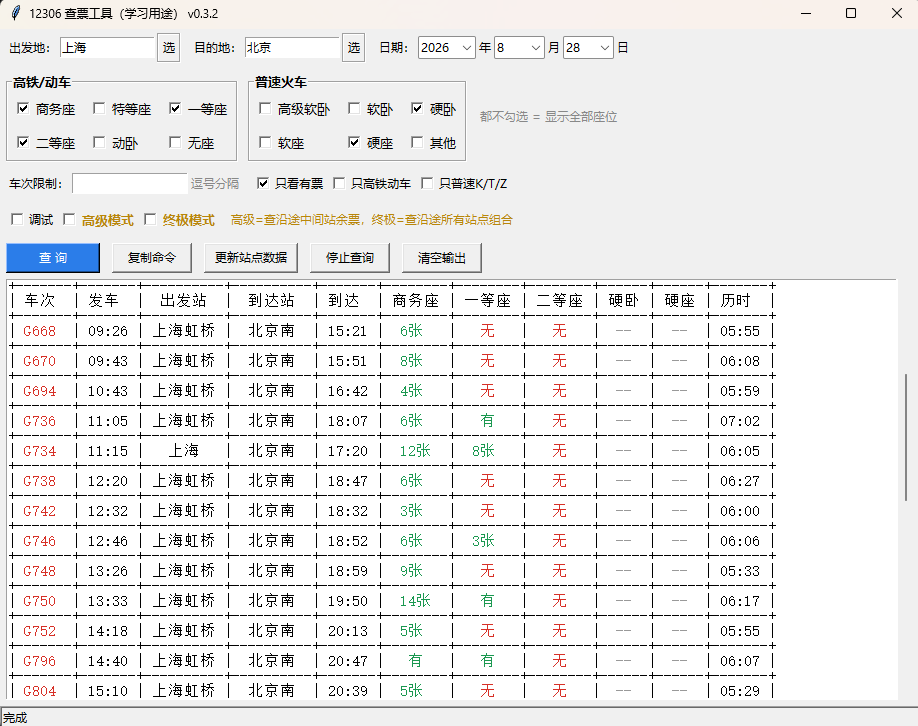

# 12306 查票工具（GUI 版）

基于 [0xHJK/x12306](https://github.com/0xHJK/x12306) 二次开发的图形界面版查票工具，把命令行查询包装成窗口操作：点几下鼠标就能查余票，结果用彩色表格显示，每个座位类型单独一列，一目了然。

当全程票售罄时，还可以用「高级模式」查询沿途中间站余票，先上车后补票。

> ⚠️ 本工具仅用于查询余票，不支持购票，请在 12306 官方平台购票。
> ⚠️ 仅供学习用途，请勿高频查询，避免账号被风控。

## 界面截图



## 功能特性

- **图形界面**：免记忆命令，双击即可使用
- **出发地 / 目的地**：既可以直接输入，也可以点【选】按 省份 → 城市 → 站点 级联选择
- **座位多选**：高铁/动车、普速火车分组勾选；一个都不勾选 = 显示全部座位
- **彩色结果表格**：每个座位类型单独一列，绿色 = 有票，红色 = 无票
- **过滤条件**：只看有票 / 只高铁动车 / 只普速 K/T/Z / 车次限制
- **高级模式**：查询始发站往后沿途各站的余票情况
- **终极模式**：查询沿途所有站点组合之间的余票
- **复制命令**：一键复制等效命令行，方便学习 CLI 用法
- **更新站点数据**：站点表过期后一键更新
- **只读输出区**：可以选中、复制、滚动，右键菜单支持复制 / 全选 / 清空

## 运行方式

### 方式一：exe（免环境，单文件）

下载 Releases 中的 `x12306-gui-v0.3.2.exe`（打包好的查票工具.exe），双击即可运行，无需安装 Python。

也可以自行打包：

```bash
py -3.9 -m pip install -r requirements.txt pyinstaller
py -3.9 -m PyInstaller 查票工具.spec
```

打包产物在 `dist/查票工具.exe`。

### 方式二：源码运行

需要 Python 3.9+：

```bash
pip install -r requirements.txt
python gui.py
```

或直接双击 `启动查票工具.bat`（首次运行会自动安装依赖）。

### 命令行模式（原版功能保留）

```bash
# 查询明天上海到北京的车票，只看有余票
python x12306.py -f 上海 -t 北京 -d "2026-09-01" -r

# 查询沿途中间站是否有票（高级模式）
python x12306.py -f 上海 -t 北京 -d "2026-09-01" -z -r
```

## 配置文件

界面上的出发地、目的地和勾选的座位会自动保存到 `gui_config.json`，下次打开自动恢复。格式见 [gui_config.example.json](gui_config.example.json)。

## 致谢

本项目基于 [0xHJK/x12306](https://github.com/0xHJK/x12306) 二次开发，查询核心逻辑来自上游项目，感谢原作者。

## LICENSE

[MIT License](LICENSE)
"# Check-12306-tickets" 
